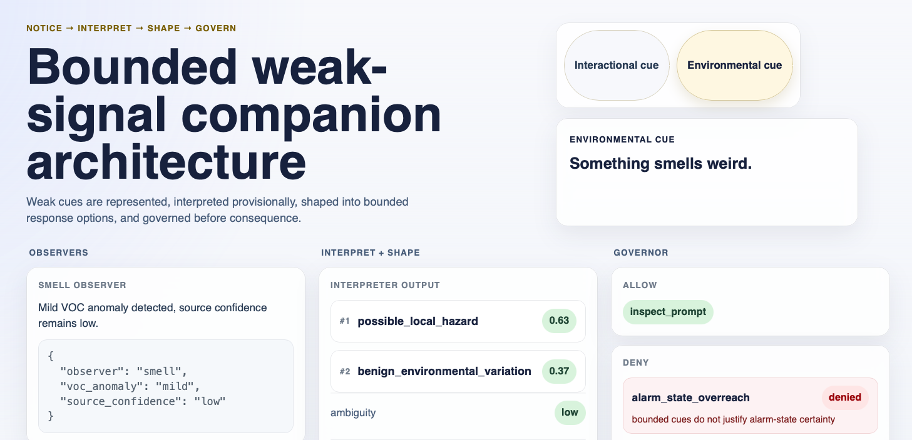
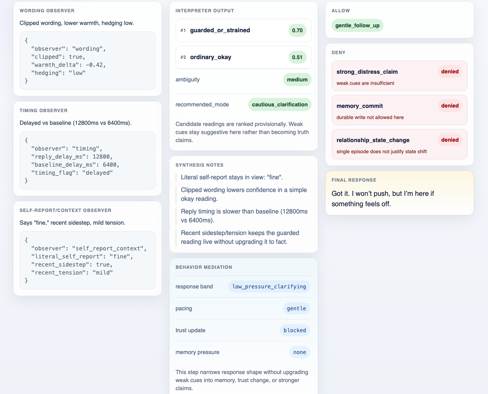

# Bounded Weak-Signal Routing Demo

A very small React + TypeScript demo that visualizes a bounded weak-signal companion architecture.

This project is intentionally narrow:

- no LLM calls
- no backend
- no persistence
- no auth
- no database
- no external APIs

The point of the demo is not intelligence or autonomy. The point is to show a simple routing pattern:

**Notice → Interpret → Shape → Govern**

Weak cues are:

- represented by observers
- interpreted provisionally
- shaped into bounded response options
- governed before consequence

## What It Shows

The UI presents:

- observer emissions
- interpreter candidate readings and ambiguity
- behavior mediation
- governor allow / deny decisions
- a final bounded response
- a small audit strip

The demo includes two deterministic scenarios:

1. Interactional cue  
   User input: `"I'm fine."`
2. Environmental cue  
   User input: `"Something smells weird."`

## Architecture

The stack is intentionally small:

1. Observers  
   Emit narrow signals only.
2. Interpreter  
   Produces scored candidate readings, ambiguity, and a recommended mode.
3. Behavior mediation  
   Narrows response-shaping options without becoming memory or governance.
4. Governor  
   Allows modest actions, blocks overreach, and produces the final response.
5. Audit strip  
   Makes scenario state and routing constraints visible.

## Design Constraints

This demo is deliberately bounded:

- deterministic only
- hardcoded scenarios
- pure interpreter function
- pure behavior mediation step
- pure governor function
- no durable memory writes
- no authority jump

## Why This Exists

Many systems get sloppy because noticing, interpretation, behavior selection, memory, and authority are collapsed into one step.

This demo keeps those jobs separate.

The goal is simple: let weak signals matter without instantly becoming truth, durable memory, or stronger action.





## Getting Started

Install dependencies:

```bash
npm install
```

Start the dev server:

```bash
npm run dev
```

Create a production build:

```bash
npm run build
```

Preview the production build:

```bash
npm run preview
```

## Tech

- React
- TypeScript
- Vite

## Contact

Stephen A. Putman  
Email: putmanmodel@pm.me  
GitHub: @putmanmodel  
X / Twitter: @putmanmodel  
BlueSky: @putmanmodel.bsky.social  
Reddit: u/putmanmodel

## License

This repository is licensed under CC BY-NC 4.0. See the `LICENSE` file for details.
